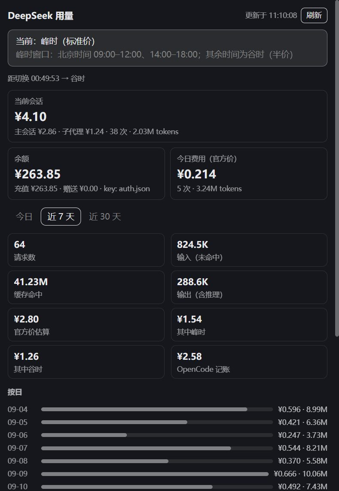
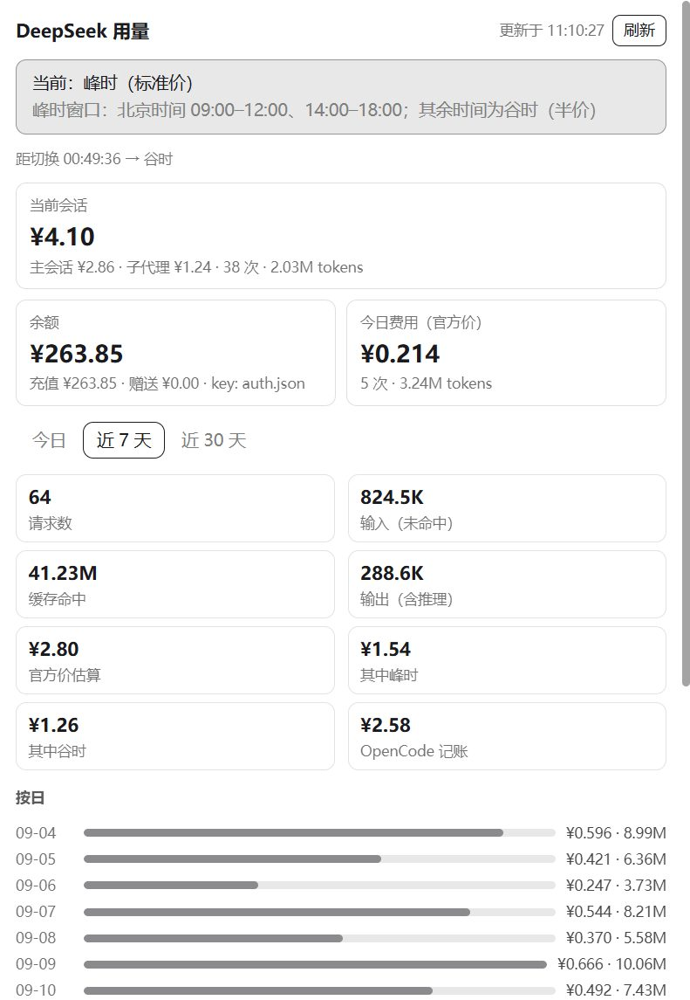

# openchamber-deepseek-usage

OpenChamber 扩展：右侧栏面板显示 DeepSeek 余额、用量和峰谷计费状态。

## 界面

| 深色 | 浅色 |
| --- | --- |
|  |  |

> 截图为 mock 预览数据（`?mock=1`），实际显示本机真实数据。

## 功能

- **余额**：DeepSeek 官方 `/user/balance`（读取本机 key，无需配置）
- **峰谷状态**：当前峰/谷、距切换倒计时、峰谷价目表
  - 峰时 = 周一至周五 01:00–04:00、06:00–10:00 UTC（北京时间 09:00–12:00、14:00–18:00）
  - 谷时 = 其余时间，价格为峰时的一半
- **用量统计**：读取本机 `~/.local/share/opencode/opencode.db` 中所有 DeepSeek 消息
  - **当前会话**：本会话（含子代理子会话）官方价、主会话 ↔ 子代理拆分、开始时间与持续时长、最近调用时间，切换会话自动刷新
  - 今日 / 近 7 天 / 近 30 天：请求数、输入（未命中）、缓存命中、输出（含推理）
  - 官方价估算（按每条消息的实际峰谷时段重算）与 OpenCode 记账值对比
  - 按日柱状、按模型明细（flash / v4-pro / 历史模型名）
- **消息菜单**：任意 DeepSeek 助手回复的 `...` 菜单里有「**本条 DeepSeek 费用**」——按该消息发生时刻的峰谷价算官方费用，弹 toast（带复制按钮），不打开面板
- **全屏看板**：会话列表上方「Extension pages」→ **DeepSeek Usage**——近 12 周日历热力图 + 会话烧钱排行（点击直接跳到该会话）
- **中英双语**：跟随 OpenChamber 界面语言（zh-* → 中文，其余 → English）
- 面板 60 秒自动刷新，可手动刷新

## 安装

1. 打开 OpenChamber → Settings → Extensions
2. 在 **Folder, ZIP, or URL** 里粘贴下面任意一个，Add：
   - GitHub（推荐，支持检查更新）：
     `https://github.com/shusongLu/openchamber-deepseek-usage`
   - 本地文件夹（开发用，改完即生效）：
     `C:\Users\XY\source\repos\openchamber-deepseek-usage`
3. 授权对话框选择 **Allow and enable**（需要允许"本地服务"）

> git 安装会把包复制到 OpenChamber 数据目录；folder 安装直接跑源码目录。
> 发布新版本时记得提升 `package.json` 里的 `version`。
> 需要 OpenChamber 1.24.1+（使用 background action 与看板页）。

## 开发

```bash
npm install
npm run build        # 生成 panel/main.js、background/main.js 与 service/main.js
node tools/preview.mjs
# 浏览器打开 http://127.0.0.1:5311/panel/index.html?mock=1&theme=dark
```

Folder 安装直接运行本目录：改代码 → `npm run build` → 在面板里重新加载扩展即可。

## 数据与口径

| 数据 | 来源 |
|---|---|
| 余额 | `GET https://api.deepseek.com/user/balance`；key 依次尝试 `~/.config/opencode/secrets/deepseek-api-key` → `~/.local/share/opencode/auth.json`（`deepseek.key`） |
| 用量 | `opencode.db`：OpenCode 2.x 读 `session_v2` + `session_message`，1.x 读 `session` + `message`（`modelID LIKE 'deepseek%'` 的 assistant 消息） |
| 官方价 | 元/1M tokens（官方中文价目）：flash `0.02/0.04`（命中）、`1/2`（未命中）、`4/8`（输出）；pro `0.15/0.3`、`4.5/9`、`13.5/27`（谷/峰） |
| 汇率 | `open.er-api.com`，12 小时缓存，失败回退 6.72；仅用于把 OpenCode 自身的美元记账折算成人民币 |

注意：OpenCode 自身按静态价目记账（美元），与官方实时峰谷价存在差异，面板两者都显示为人民币。

## English

An OpenChamber extension: a rail panel, a message-menu action and a full-screen dashboard for your DeepSeek balance, usage and peak/off-peak billing (CNY).

- **Balance** from the official `GET /user/balance` endpoint; the local service finds your API key automatically (`~/.config/opencode/secrets/deepseek-api-key`, then `~/.local/share/opencode/auth.json`)
- **Peak / off-peak**: current phase, countdown and the official price table. Peak hours are Mon–Fri 01:00–04:00 & 06:00–10:00 UTC (Beijing 09:00–12:00, 14:00–18:00); off-peak is half price
- **Usage** aggregated read-only from the local `opencode.db`: current session (incl. subagents, start time and duration), today / 7 days / 30 days, daily bars, per-model breakdown, official CNY cost recomputed per message versus OpenCode's own USD record (converted at the live rate)
- **Message action**: “本条 DeepSeek 费用 / Message cost” inside any assistant message's `…` menu — a background action that shows a persistent, copyable toast without opening a panel
- **Dashboard**: “Extension pages” → DeepSeek Usage — a 12-week calendar heatmap and a session ranking (click a row to open that session)
- **Bilingual UI**: follows the host locale (zh-* → Chinese, otherwise English)

Install: OpenChamber → Settings → Extensions → paste `https://github.com/shusongLu/openchamber-deepseek-usage` → **Allow and enable**. Requires OpenChamber 1.24.1+.

The extension requests the `sessions` capability (to open a session from the dashboard) and permission to run its local service. The service only reads `opencode.db`, calls the DeepSeek balance endpoint and fetches a USD→CNY rate.

